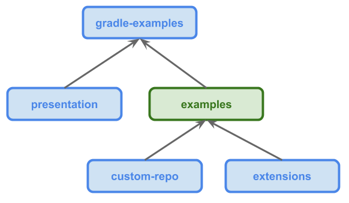

layout: true
class: top

---

class: center middle

.logo[]

## Survival guide for Java developers

---
class: center middle

.half[]

When you want to build your project…

---

## Maven

* fast and easy to start
* not so easy when you don’t want it the standard way

.half[]

---

## Ant

* you can do everything
* customization requires a lot of skill and work

.half[]

---

## Gradle

* custom made furniture with your guidance

.half[]


---

## A balance between Maven and Ant

* relatively unopinionated (while Maven imposes standards)
* flexible - any project structure is possible
* scriptable - no extra tooling needed, everything is Groovy
* extensible - many plugins available, easy to create new ones

---


## Basic concepts

* project
* project dependencies
* tasks
* plugins

---

## Project

* tree-like structure - *settings.gradle*
  * root project
  * child projects
  * sub-projects
  * all projects
* paths
  * separated by ":"
  * absolute if starts with the separator
  * else relative to the current project
  
---

## Project
  
.half[]

---

## Project dependencies

* grouped into `configurations`
* types of configurations are determined by plugins, ie. Java plugin:
  * `compile`
  * `testCompile`
  * ...
* deterministic conflict resolution

---

## Project dependencies

```groovy
dependencies {
    compile project(':another-project')
    
    compile 'args4j:args4j:2.32'
    
    runtime 'org.log:simple:1.7.12'
    
    testCompile 'com.ab:cd:1.16.0'
}
```

---

## Project dependencies - repos

* different types (@see `RepositoryHandler`)
* `mavenCentral()`, `jcenter()`, …
* custom repos (maven, ivy, local directories)

---

## Project dependencies - repos

```groovy
repositories.ivy {
    url 'http://central.maven.org/maven2/'
    layout('pattern') {
        artifact '[organisation]/[module]/[revision]/[module]-[revision].[ext]'
    }
}

dependencies {
    testCompile 'junit:junit:4.12@jar'
    //...
}
```

---

## Tasks

* allow the build user to indicate things to execute
* defined directly in the script or in a plugin
* can depend on one another to control execution flow

---

## Tasks

### Define in a script

```groovy
task task1(type: Zip) {
//...
}

task task2 {
//...
}
```

---

## Tasks

### Define in a script or in a plugin

```groovy
project.task('task3') {
//...
}

project.task('task4', type: Zip) {
//...
}

```

---

## Tasks

### Dependencies

```groovy
task3.dependsOn task4

tasks.task3.dependsOn 'task4'

tasks.getByName('task3') dependsOn 'task4'
```

---


## Project Lifecycle

* initialization
    * determine if single or structure of multiproject
* configuration
    * project: `beforeEvaluate`, `afterEvaluate`
    * `gradle.afterProject` … (`Gradle` interface)
* execution
    * run specified tasks

---

## Project Lifecycle
    
```groovy
println 'Configuration 1'

project.afterEvaluate {
    println 'Configuration 3'
}

task someTask {
    println 'Configuration 2'
} doFirst {
    println 'Execution 1'
} doLast {
    println 'Execution 2'
}

```    

---

## Using plugins
### Core plugins

```groovy
apply plugin: 'java'

```

---

## Using plugins
### 3rd party plugins

'old' syntax

```groovy
buildscript {
    repositories {
        jcenter()
    }
    dependencies {
        classpath 'net.researchgate:gradle-release:2.6.0'
    }
}

apply plugin: 'net.researchgate.release'

```

---

## Using plugins
### 3rd party plugins

Plugin DSL

```groovy
plugins {
    id "org.jetbrains.intellij" version "0.2.11"
}
```


---

## Using plugins
### From script

```groovy
apply from: 'other.gradle'
```

---

## Using plugins
### From class

```groovy
apply plugin: net.researchgate.release.ReleasePlugin

apply plugin: com.example.ExamplePlugin
```

---

## Why does my build script look like JSON?

---

## Why does my build script look like JSON?

.half[]

---

## Groovy - dynamic Java

* Most of the time, Java 7 is valid Groovy


```groovy
public <T> List<T> nonNulls(List<T> list) {
    return filter(list, new Closure<Boolean>(this) {
        @Override
        public Boolean call(Object arg) {
            return arg != null;
        }
    });
}

public <T> List<T> filter(List<T> list, Closure<Boolean> closure) {
    List<T> result = new ArrayList<>();
    for (T item : list) {
        if (closure.call(item)) {
            result.add(item);
        }
    }
    return result;
}
```

* Java 8 lambda syntax won't compile

---

## Groovy - dynamic Java?

* But idiomatic Groovy hardly looks like Java

```groovy
def nonNulls(list) {
    filter(list) { it != null }
}

def filter(list, closure) {
    def result = []
    list.each {
        if (closure(it)) {
            result.add it
        }
    }
    result
}
```

.bottom-right[]

---

## Method call syntax

* omit brackets and semicolons

```groovy
method(x, y);
``` 


```groovy
method x, y
``` 


---

## Method call syntax

* pass map literals   

```groovy
apply(['plugin': 'java'])
```

```groovy
apply plugin: 'java'
``` 

---

## Method call syntax

* chain method calls   

```groovy
product 'IDEA'  withVersion '17.0.3' withCode 'IJ17' 
``` 

```groovy
product('IDEA').withVersion('17.0.3').withCode('IJ17')
``` 

---

## Method call syntax

* last argument of Closure type   

```groovy
method('x', { action(it) })
``` 

```groovy
method('x') { action(it) }
``` 

---

## Closures

### Literals

```groovy 
{ String x -> action(x) }

{-> action( ) }

{ action(it) }

subprojects { println "configuring project $name"}
```

---

## Closures

### An instance of Closure subclass

```groovy
new Closure(this) {
    @Override
    Object call(Object... args) {
    //...
    }
}
```

---

## Closure delegation

* `this` - object of enclosing class
* `owner` - enclosing object (class or closure)
* `delegate` - owner by default, can be changed
* `resolveStrategy` - owner|delegate first|only

---

## Understanding build.gradle

* invoked almost like a `Closure` on `gradle.api.Project`

```groovy
project.with {
//...
}
```

* with DSL task syntax

```groovy
task task1 doLast {
//...
}
```

---

## Gradle syntax - JSON-like constructs?

```groovy
allprojects {


 
        repositories {
        
        
                              mavenCentral()
            
        }
        
        
        apply plugin: 'java'
        dependencies {
        
        
        
                         testCompile "junit:junit:4.12"
                         
        }
        
        
        
}
```

---

## ...are actually method calls

```groovy
project.allprojects({


        repositories({
        
        
                              mavenCentral()
            
        })
    
    
        apply([plugin: 'java'])
        dependencies({
        
        
        
                         testCompile("junit:junit:4.12")
                         
        })


})
```

---

## invoked on delegates

```groovy
project.allprojects({


        getDelegate().repositories({
        
        
                getDelegate().mavenCentral()
            
        })
        
        
        getDelegate().apply([plugin: 'java'])
        getDelegate().dependencies({
        
        
                getDelegate()
                        .testCompile("junit:junit:4.12")
            
        })

        
})
```

---

## of Groovy Closures

```groovy
project.allprojects(new Closure(this) {

    Object call(Object... arguments) {
    
        getDelegate().repositories(new Closure(this) {
        
            Object call(Object... args2) {
                getDelegate().mavenCentral()
            }
        })
        
        
        getDelegate().apply([plugin: 'java'])
        getDelegate().dependencies(new Closure(this) {
        
            Object call(Object... args2) {
                getDelegate()
                        .testCompile("junit:junit:4.12")
            }
        })
        
    }
})
```

---

## of Groovy Closures

```groovy
project.allprojects(new Closure(this) {

    Object call(Object... arguments) {

        getDelegate().repositories(new Closure(this) {
        
            Object call(Object... args2) {
                getDelegate().mavenCentral()
            }
        })
        Map<String, String> options = new HashMap<>()
        options.put("plugin", "java")
        getDelegate().apply(options)
        getDelegate().dependencies(new Closure(this) {
        
            Object call(Object... args2) {
                getDelegate()
                        .testCompile("junit:junit:4.12")
            }
        })
        
    }
})
```

---

## without type casts

```groovy
project.allprojects(new Closure(this) {

    Object call(Object... arguments) {
        Project delegate = (Project) getDelegate();
        delegate.repositories(new Closure(this) {
        
            Object call(Object... args2) {
                ((RepositoryHandler) getDelegate()).mavenCentral();
            }
        });
        Map<String, String> options = new HashMap<>();
        options.put("plugin", "java");
        delegate.apply(options);
        delegate.dependencies(new Closure(this) {
        
            Object call(Object... args2) {
                ((DependencyHandler) getDelegate())
                        .testCompile("junit:junit:4.12");
            }
        });
        
    }
});
```

---

## …but DependencyHandler has no testCompile method?!

```groovy
public interface DependencyHandler {
    Dependency add(String configurationName, Object dependencyNotation);
    Dependency add(String configurationName, Object dependencyNotation, 
        Closure configureClosure);
    Dependency create(Object dependencyNotation);
    Dependency create(Object dependencyNotation, Closure configureClosure);
    Dependency module(Object notation);
    Dependency module(Object notation, Closure configureClosure);
    Dependency project(Map<String, ?> notation);
    Dependency gradleApi();
    Dependency gradleTestKit();
    Dependency localGroovy();
    ComponentMetadataHandler getComponents();
    void components(Action<? super ComponentMetadataHandler> configureAction);
    ComponentModuleMetadataHandler getModules();
    void modules(Action<? super ComponentModuleMetadataHandler> configureAction);
    ArtifactResolutionQuery createArtifactResolutionQuery();
    AttributesSchema attributesSchema(
        Action<? super AttributesSchema> configureAction);
    AttributesSchema getAttributesSchema();
    void registerTransform(Action<? super VariantTransform> registrationAction);
}
```

---

## …but DependencyHandler has no testCompile method?!

.half[]

---

## Or maybe it does…

```java
public class DefaultDependencyHandler 
    extends GroovyObjectSupport 
    implements DependencyHandler, MethodMixIn {
    //...    
}

/**
 * A decorated domain object type may optionally 
 * implement this interface to dynamically expose methods 
 * in addition to those declared statically on the type.
 *
 * Note that when a type implements this interface, 
 * dynamic Groovy dispatch will not be used to 
 * discover opaque methods. That is, methods such 
 * as methodMissing() will be ignored.
 */
public interface MethodMixIn {
    MethodAccess getAdditionalMethods();
}
```

---

## …have methods added in runtime 

```groovy
@Test
void addMethodToMetaClass() {
    def world = 'World'

    world.metaClass.hello = { "Hello, $delegate!".toString() }

    assertThat world.hello(), equalTo("Hello, World!")
}
```

---


## No magic - valid Java

```groovy
project.allprojects(new Closure(this) {
    @Override
    public Object call(Object... arguments) {
        Project delegate = (Project) getDelegate();
        delegate.repositories(new Closure(this) {
            @Override
            public Object call(Object... args2) {
                return ((RepositoryHandler) getDelegate()).mavenCentral();
            }
        });
        Map<String, String> options = new HashMap<>();
        options.put("plugin", "java");
        delegate.apply(options);
        delegate.dependencies(new Closure(this) {
            @Override
            public Object call(Object... args2) {
                return ((DependencyHandler) getDelegate())
                        .add("testCompile", "junit:junit:4.12");
            }
        });
        return null;
    }
});
```


---

## And groovy again

```groovy
allprojects {
    repositories {
        mavenCentral()
    }

    apply plugin: 'java'

    dependencies {
        testCompile 'junit:junit:4.12'
    }
}
```

.bottom-right[]

---

## Modularizing the build

* `buildSrc` sub-project
* included automatically in the build classpath
* has access to Gradle and Groovy API
* it’s a full featured project - can have `build.gradle`, tests etc

---

## Plugins

* implement `org.gradle.api.Plugin<Project>` 
* `apply(Project)` method
* applied in the scripts (`apply plugin: MyPlugin`)
* full access to project
* can create tasks, execute code, manipulate the model
* can be configured via extensions

---

## Extensions

the simplest way of making plugins configurable
* create extension (in the plugin)
* configure (in the build script)
* use the values (in the plugin)

```groovy
TODO generify

extensions.create("someExtension", ApiDiffExtension)

someExtension {
    app 'x', 'y'
}

afterEvaluate {
    println extensions.getByType(ApiDiffExtension).suiteApps
}
```

---

## Extensions - containers

```groovy
class App {
    final String name
    String version
    App(String name) { this.name = name }
}

project.extensions.apps = project.container(App)

apps {
    pc { version = '9.0.4' }
    cc { version = '9.0.3' }
}

afterEvaluate {
    apps.each { println "APP $it.name = $it.version" }
}
```

---

## There is more…

* https://gradle.org/docs/
* http://groovy-lang.org/documentation.html
* Kotlin DSL

---

## Thanks!

.half[]

